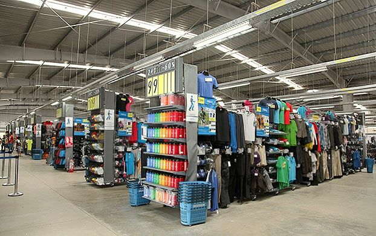
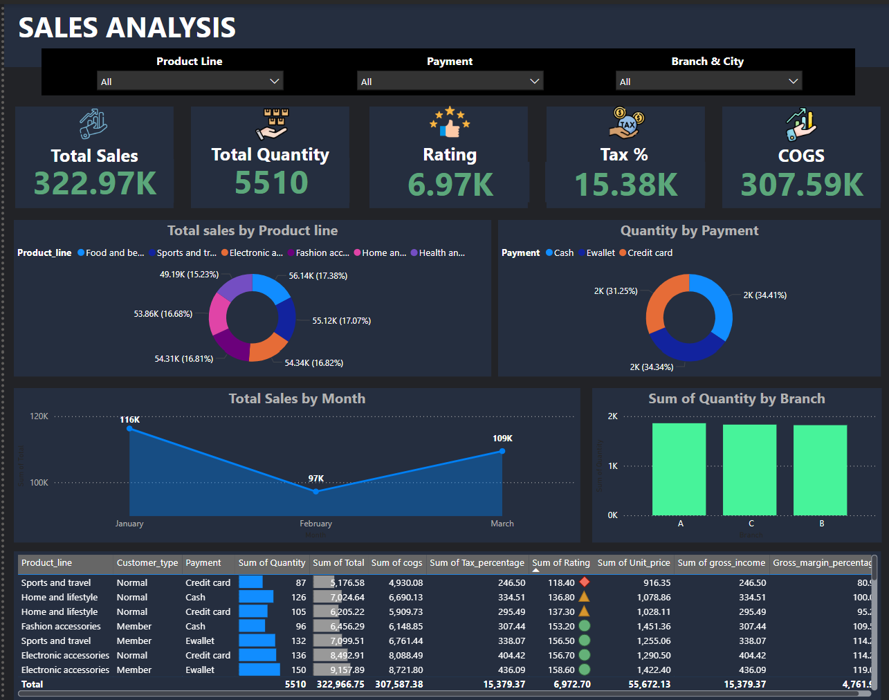

# 🛒 Supermarket Sales Analysis

This repository contains a comprehensive analysis of supermarket sales data using SQL and Power BI. The goal is to uncover patterns in customer behavior, product performance, and branch efficiency to help improve decision-making. 

---

## 📊 Overview

This project leverages a cleaned and transformed sales dataset from a supermarket to answer key business questions. The dataset includes information on customer types, product lines, payment methods, branch details, and more. 

*You can access the cleaned dataset [here](https://github.com/ToriAtas/Supermarket_sales_analysis/blob/main/supermarket_sales.csv)* 

---

## 📈 Key Business Questions Answered
- How do different customer types and genders impact purchase frequency, average transaction amount, and total sales?
- Which customer segments drive the most revenue?
- Which product lines are most frequently purchased (i.e., high-demand)?
- How does sales volume differ across branches?
- How do sales fluctuate month-to-month?
- Which payment methods are most popular among customers?
- What are the total sales, taxes collected, and cost of goods sold (COGS)?
- What does the rating distribution reveal about customer experiences?

---

## 🛠️ Tools Used
- **SQL**: For querying and deriving insights from structured data.
- **Power BI**: For building responsive, interactive dashboards.

### SQL Analysis

- **Customer Spending Behavior**
  - Female members spend more per transaction and generate higher overall sales.
  - Normal male customers buy frequently but spend less per purchase.
- **Product Demand Analysis**
  - High-demand products include Electronic Accessories, Home and Lifestyle, and Health & Beauty, each averaging more than 5 items per transaction.
- **Branch Performance**
  - **Branch A** ranks highest in customer ratings, suggesting superior service quality.
- **Pricing Insights**
  - Fashion Accessories have the highest unit price, indicating strong revenue potential.

*You can access the queries [here](https://github.com/ToriAtas/Supermarket_sales_analysis/blob/main/Sales_Analysis_SQL.sql)*

---

## 📊 POWER BI Visualization

# Features
1. **Sales by Product Line** – Top contributors include:
   - Food and Beverages
   - Sports and Travel
   - Electronic Accessories
2. **Payment Type Usage** – Cash and E-wallet dominate.
3. **Monthly Sales Trends** – January saw peak sales; February dipped.
4. **Branch Volume Comparison** – Branches A & C outperform Branch B in item volume.

# Insights
- Branch A should serve as a performance benchmark.
- February sales dip may be targeted with marketing campaigns.
- E-wallets are gaining popularity and should be promoted.
- Focus should shift to high-margin products for profitability.

_You can access and interact with the Power BI dashboard_ [here](https://github.com/ToriAtas/Supermarket_sales_analysis/blob/main/Sales_Dashboard_PowerBI.pbix)

---

## Conclusions

The sales analysis shows a total revenue of 322.97K with 5,510 items sold. Most sales came from Food and beverages and Sports and travel, while Cash and Ewallet were the most common payment methods. Branches A and C recorded the highest sales quantity. Customer ratings are generally positive, and there is a fairly balanced sales distribution across product lines. 

---

## Recommendations

- Boost sales in low-performing periods like February.
- Enhance Branch B’s performance through support and strategy.
- Encourage digital payments via promotional incentives.
- Optimize inventory around products with high gross margin.

*By implementing these recommendations, the organization can optimize revenue, enhance customer satisfaction, and improve workforce efficiency, ensuring sustained growth and profitability.* 🙂

---

## 🧾 Files

- `SALES DATA REPORT.docx`: Contains detailed analysis via SQL and Power BI.
- `powerbi_dashboard.pbix`: Interactive dashboard file.
- `sql_queries.sql`: SQL scripts used for analysis.

---

## 🚀 How to Use
1. Download the `.pbix` file (Power BI file) from the repository.
2. Open with Power BI Desktop.
3. Connect to the provided Excel data source (if shared).
4. Explore the dashboard visuals and adjust filters as needed.

## 📝 Report Summary
A detailed written report is included in this repo (`Supermarket Sales Analysis Report`), summarizing all analytical findings and strategic recommendations for business optimization.

---
[Supermarket Sales Analysis Report](https://github.com/ToriAtas/Supermarket_sales_analysis/blob/main/SALES_DATA_REPORT_forDashboard1.pdf)

## 📌 Note
If you find this project insightful, feel free to star ⭐ the repo or connect with me for freelance collaborations or dashboard development projects.

